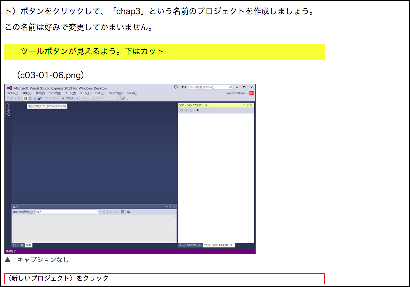
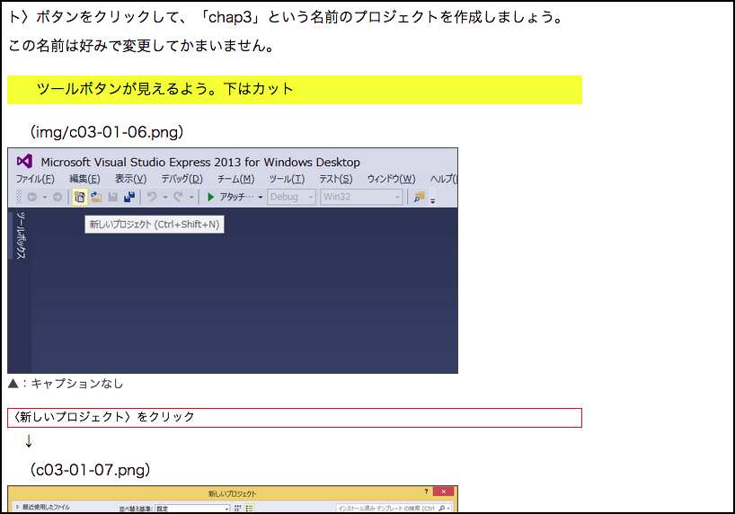

MarkDownImageTrim
=================

Markdown原稿中のイメージのトリミング指定をする

#何？

Markdownで原稿を書いていて、元画像そのものはトリミングしたくない、でもDTPオペレータさん向けに大まかなトリミング指示はしたい……というときに使うスクリプトです。画像表示に使う``にちょっと追記してやるだけで、書き出したHTML上でトリミングされます。

適宜LiveReloadなどと組み合わせて使ってください。

マイナーチェンジして拡大率も自分で指定するようにしました。

#使い方

Markdownの先頭でスクリプトとCSSを読み込みます。
```
<script src="../cssjs/jquery-2.0.3.min.js"></script>
<script src="../cssjs/addimagename.js"></script>
<link rel="stylesheet" href="../cssjs/myrule.css"> 
```

以下のように画像を読み込むと……
```

```
そのまま表示されます。一応文章で上にトリミング指示を書いていますがわかりにくいですね。



画像ファイル名の後にクエリ文字列風の「`?clip=0+0+600+300`」という文字列を足してやります。
```

```
はい、トリミングされました。



ここまでやっておけば、IT書の制作に慣れているオペレータさんなら、画像をトリミングして、カンで囲みと図中文字を入れてくれるはずです。
後は間違っているところだけ初校で直せばOK。

#しくみ
ファイル名の後に`?clip=x+y+w+h`という具合に、トリミングの左上座標(x,y)と幅(w)、高さ(h)を指定すると、img要素をbackground-image付きのdiv要素に置き換えます。


拡大率も指定したい場合は「zoom=50」のように記述します。clipと組み合わせる場合は、クエリ文字列と同じように「&」で区切って指定します。